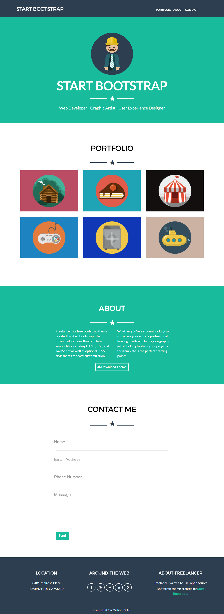

# Freelancer

* **Track:** _Common Core_
* **Curso:** _Creando tu primer sitio web interactivo_
* **Unidad:** _Maquetado web con HTML & CSS_

***

## Objetivo

El reto consiste en replicar el sitio de **Freelancer**.

  > Nota: Este reto es enfocado en la maquetación lo más parecido posible, usando lo aprendido en clase. El sitio original tiene ciertos efectos y funcionalidades que  están fuera del alcance de este reto.

***

## resultado

